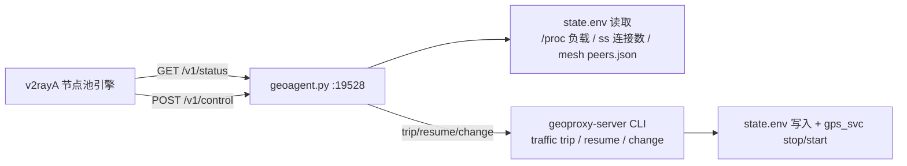

# GeoProxy Agent（v2rayA 节点池上报/控制面）设计

日期：2026-08-25
状态：已获用户确认（客户端池功能第 2 节决策 A：geoproxy-server 新增上报 Agent）

## 背景与目标

v2rayA 客户端新增了"节点池"功能（池管理 + 流量硬门槛均衡 + 远程熔断控制），客户端按契约轮询各 VPS 的上报 Agent 并下发控制指令。本设计在 **geoproxy-server** 实现该 Agent：

- 每台 VPS 跑一个轻量 HTTP 服务（`:19528/tcp`，Bearer Token 鉴权），与 mesh 控制面（`:19527`）解耦
- `GET /v1/status`：上报节点标识、系统负载、活跃连接数、流量用量/配额/熔断状态、mesh 角色
- `POST /v1/control`：远程 `trip`（立即熔断）/ `resume`（恢复）/ `set-thresholds`（改阈值）/ `set-check-interval`（改检查间隔）

权威契约：v2rayA 仓库 `docs/geoproxy-agent-api.md`（字段与语义以该文件为准；实现时在本仓库 `docs/` 同步一份副本）。

## 架构



- **状态**：`geoagent.py` 直接读 `state.env`（只读、无副作用），不触碰 sing-box
- **控制**：通过 CLI 命令落地（复用既有 `traffic resume`、`change traffic-warn/stop/interval`），新增 `traffic trip`
- **活跃连接数**：`ss`/`/proc/net/tcp` 统计到代理入站端口的 established 连接（sing-box 未开 API，不做侵入改动）
- **延迟**：best-effort 探测 `generate_204`（3s 超时，缓存 30s）；探测失败返回空值，不影响状态响应

## 组件清单

### 1. `scripts/geoagent.py`（新增，仿照 `scripts/mesh_master.py`）

- 纯 Python 标准库 `ThreadingHTTPServer` + `BaseHTTPRequestHandler`
- 环境变量配置：`GPS_AGENT_BIND`（默认 `0.0.0.0`）、`GPS_AGENT_PORT`（默认 `19528`）、`GPS_AGENT_TOKEN`（必须非空，否则拒绝启动）、`GPS_STATE`（state.env 路径）、`GPS_MESH_PEERS`、`GPS_CONFIG`（读节点名/PROTOCOL）
- `GET /v1/status`（Bearer 校验）→ 200 JSON：
  ```json
  {
    "node": { "id": "<主机名/节点名>", "protocol": "<PROTOCOL>", "version": "<VERSION>" },
    "system": { "load1": 0.35, "cpuPct": 5.2, "memUsedPct": 42.1, "activeConnections": 23 },
    "latency": { "target": "https://www.gstatic.com/generate_204", "ms": 18 },
    "traffic": {
      "usedBytes": 0, "quotaBytes": 0, "usedPct": 0, "warnPct": 80, "stopPct": 95,
      "nextReset": "", "tripped": false, "trippedAt": null, "checkSec": 300
    },
    "mesh": { "role": "master", "peerCount": 4 },
    "reportedAt": "2026-08-25T10:00:00Z"
  }
  ```
- `POST /v1/control`（Bearer 校验，body ≤ 8KB）→ 200 `{"ok": true}` 或 4xx + `{"error": "..."}`

### 2. `lib/traffic.sh`：新增 `gps_cmd_traffic_trip`

```bash
gps_cmd_traffic_trip()   # 立即熔断：TRAFFIC_TRIPPED=1 + save_state + gps_svc stop + 写 traffic.log
```
注册进 `gps_cmd_traffic` 的 case（`trip)`）。

### 3. Token 与凭证

- 安装/启用时生成 `GPS_AGENT_TOKEN`（`openssl rand -hex 24`），写入 `/etc/geoproxy-server/agent.env`（`umask 077`，仅 token）
- **不进 argv、不落日志**；systemd `EnvironmentFile` 喂给 geoagent.py
- CLI 查看：`geoproxy-server agent`（显示监听地址 + token 脱敏）/ `geoproxy-server agent token`（明文，供 v2rayA 池配置复制）

### 4. systemd 单元 `templates/geoproxy-agent.service`

仿 `geoproxy-mesh-master.service`：`Type=simple`、`EnvironmentFile=-agent.env`、`ExecStart=python3 <GPS_ROOT>/scripts/geoagent.py`、`Restart=on-failure`、`ProtectSystem=strict` + `ReadWritePaths` 仅日志目录、`NoNewPrivileges` 等硬化项；`WantedBy=multi-user.target`。

### 5. 集成点

- `lib/systemd.sh`：`gps_ensure_agent_units`（写单元 + enable）+ 卸载清理；随主服务安装默认启用
- `lib/firewall.sh`：放行 `19528/tcp`（沿用 mesh master 的防火墙处理函数）
- `lib/cmd.sh` / `geoproxy-server.sh`：注册 `agent` 子命令；`install.sh` 安装流程调用单元确保函数
- `lib/paths.sh`：新增 `GPS_AGENT_*` 常量（端口/单元路径/agent.env 路径/脚本路径）

## 状态字段 ↔ state.env 映射

| /v1/status 字段 | 来源 |
|---|---|
| `node.id` | state.env `TUIC_NAME`（缺省回退 `hostname -f`/`hostname`，与 `gps_tuic_node_name()` 一致） |
| `node.protocol` | state.env `PROTOCOL`（默认 tuic） |
| `node.version` | `VERSION` 文件（只读） |
| `system.load1` | `/proc/loadavg` |
| `system.cpuPct` / `memUsedPct` | `/proc/stat` + `/proc/meminfo`（1s 采样窗口） |
| `system.activeConnections` | `ss -tn state established` 统计到入站端口的连接数 |
| `latency` | best-effort 探测（缓存 30s；失败返回 `null`） |
| `traffic.usedBytes` | `TRAFFIC_USED_BYTES` |
| `traffic.quotaBytes` | `TRAFFIC_LIMIT_BYTES × TRAFFIC_MULT` |
| `traffic.usedPct` | `TRAFFIC_LAST_PCT` |
| `traffic.warnPct`/`stopPct`/`checkSec` | `TRAFFIC_WARN_PCT`/`TRAFFIC_STOP_PCT`/`TRAFFIC_CHECK_SEC` |
| `traffic.nextReset` | `TRAFFIC_RESET`（unix → RFC3339） |
| `traffic.tripped` / `trippedAt` | `TRAFFIC_TRIPPED`（1→true）+ 日志时间（无则 null） |
| `mesh.role` / `peerCount` | state.env `MESH_ROLE`（缺省 master）+ `peers.json` 计数 |
| `reportedAt` | 请求时刻 UTC RFC3339 |

未配置 KiwiVM 时：`usedBytes/quotaBytes/usedPct` 返回 0、`warnPct/stopPct/checkSec` 返回默认值（80/95/300），不报错（客户端据此判断"未接入流量监控"）。

## 控制动作映射

| action | 校验 | 落地 |
|---|---|---|
| `trip` | 无 | 执行 `geoproxy-server traffic trip` |
| `resume` | 无 | 执行 `geoproxy-server traffic resume`（内部先验未超停服线） |
| `set-thresholds` | `0 < warnPct < stopPct < 100` | `change traffic-warn` + `change traffic-stop` |
| `set-check-interval` | `seconds ≥ 60` | `change traffic-interval` |

- 执行失败返回 `500 {"error": "..."}`（含 CLI 输出摘要，去敏：KiwiVM API Key 只保留 `****`）
- 未知 action / 参数非法 → `400`
- 未安装（state.env 缺失）→ `503`

## 安全设计

- Token：安装时 `openssl rand -hex 24`；`agent.env` 0600；systemd EnvironmentFile 注入（不进 argv）；日志脱敏
- HTTP：默认明文（内网/公网均可按需配 TLS；v1 不做 TLS，Token 承担鉴权 —— 与 mesh 控制面 TLS 不同，文档注明建议配合防火墙限制来源）
- 请求体上限 8KB；Bearer 比较用 `hmac.compare_digest`
- 输出消毒：control 错误响应不回显 API Key / token

## 测试策略（bats，`tests/test_agent.bats`）

- 鉴权：无 token / 错 token → 401
- `GET /v1/status`：200 + JSON 字段齐全（node/system/traffic/mesh/reportedAt），KiwiVM 未配置时默认值正确
- `POST /v1/control`：四个动作校验（缺参/越界 → 400；未知 action → 400）
- `trip` 副作用：`TRAFFIC_TRIPPED=1` + 服务被停（`GPS_TEST_PREFIX` 沙箱）
- `resume`：低于停服线恢复、高于停服线拒绝
- `set-thresholds`/`set-check-interval` 落到 state.env
- 卫生：shellcheck 无 error、shfmt 无漂移、bats 全量通过

## 版本与发布

- `VERSION` → **v0.2.43**（patch+1，`v0.2.42` 已发布）
- `CHANGELOG.md` 顶部追加 `## v0.2.43 - YYYY-MM-DD`；`README.md` 增补 Agent 章节（端口、token、与 v2rayA 节点池对接方式）
- 提交推送 + tag `v0.2.43`（GitHub Actions release.yml 自动构建发布物），不手动创建 Release

## 非目标（本版本）

- Agent TLS（v1 用 Bearer Token + 建议防火墙限定来源）
- sing-box 运行时 API 集成（活跃连接数用 ss 近似）
- 客户端自动发现 Agent（地址/Token 手工配置于 v2rayA 池）
- 多用户/审计日志
